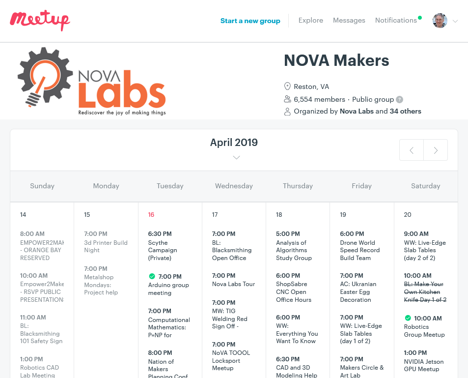
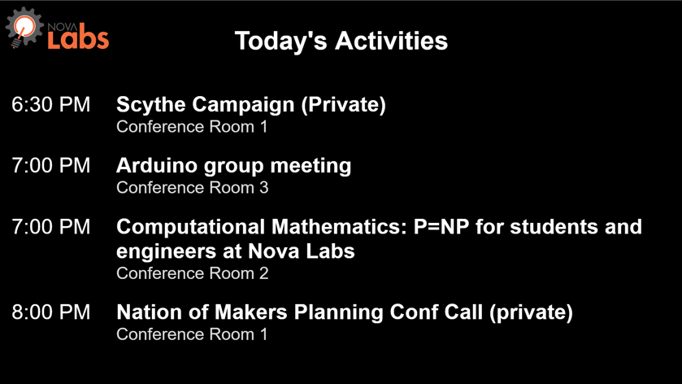
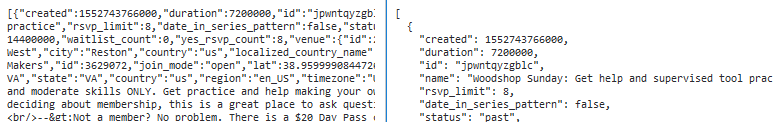
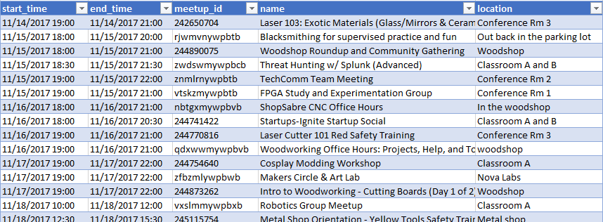
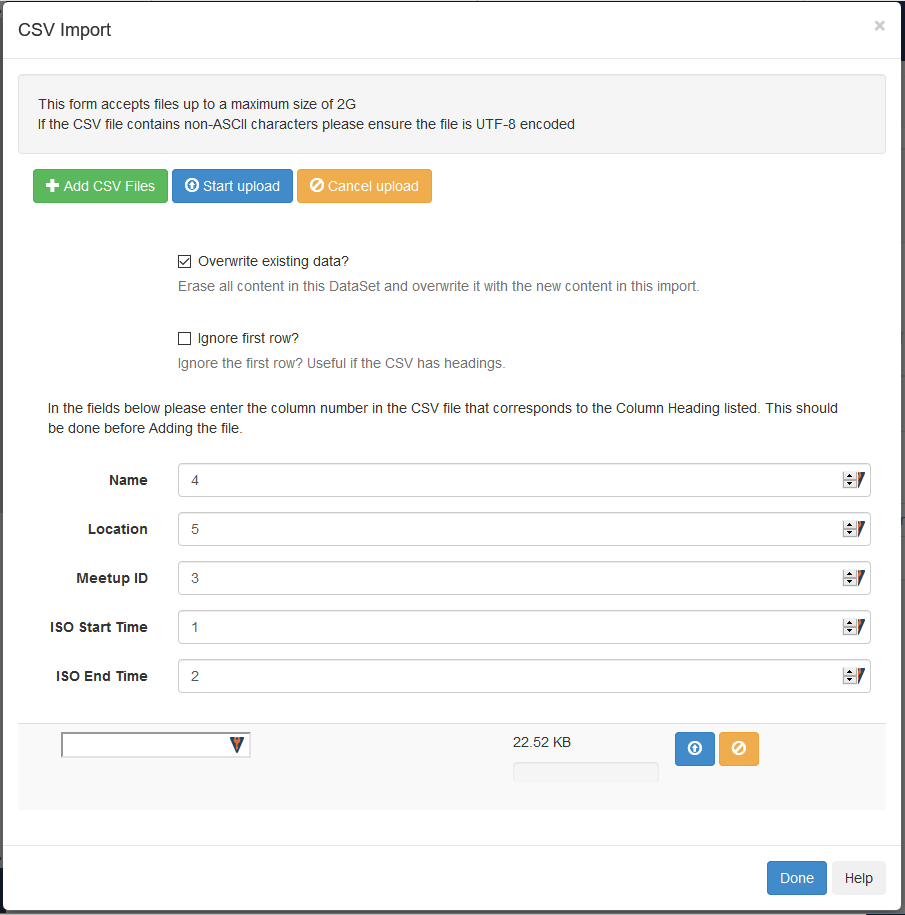
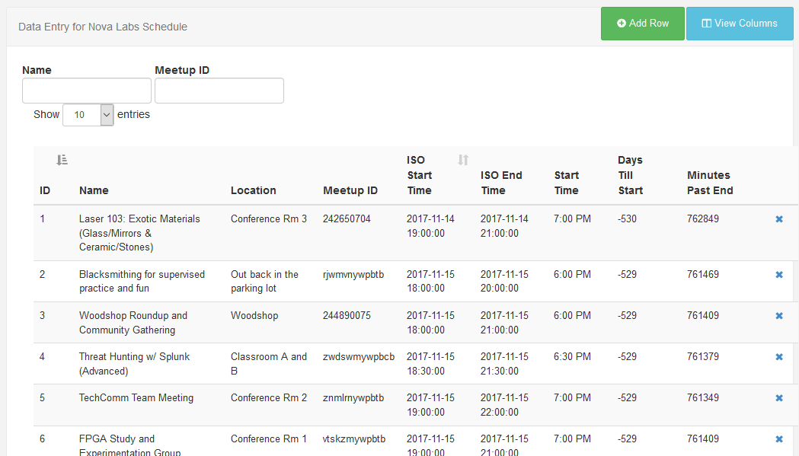

==========
Background
==========

Nova Labs announces events and registers participants with Meetup.com.
Nova Labs display event schedules and other information with Xibo.
Meetup2xibo replaces a manual process for downloading Meetup.com event
information into Xibo.

The Players
-----------

.. index:: Nova Labs

`Nova Labs`_ is a makerspace in Reston, Virginia with over 300 members (as of
April 2019).
Nova Labs members can access a woodshop, a metal shop, laser cutters, 3D
printers, an electronics bench, sewing and embroidery machines, vinyl cutters,
a blacksmithing forge, and many other maker tools.
To build communities of makers, Nova Labs offers a busy schedule of classes,
meetings, workshops, and other events to its members and guests.

.. index::  Meetup.com

`Meetup.com`_ is a web-based service that helps organize physical events for
people with similar interests.
Meetup.com maintains a database of events, provides event web pages, and
handles attendee registration details.
Equally important, Meetup.com suggests other related events to participants,
helping event organizers to reach potential new attendees.

Nova Labs maintains its `full calendar of events`_ on Meetup.com.
:numref:`Figure %s <meetup_calendar_screenshot>` shows the Meetup.com calendar
for one week of Nova Labs events.

   An example of a Meetup.com calendar of events at Nova Labs.

.. index:: Xibo

`Xibo`_ is an open source, web based, digital signage system.
The Xibo :abbr:`CMS(Content Management System)` allows administrators to design
sign layouts and schedule them on sign displays.
The Xibo CMS is written in PHP and stores data in a MySQL database.
Xibo client software runs on Windows- or Android-based compters connected to
display monitors.

Nova Labs installed Xibo in August 2017 to control sign display monitors at the
entrance door, the front desk, and elsewhere.
Nova Labs has created dozens of sign layouts including a daily agenda
(:numref:`Figure %s <xibo_agenda_screenshot>`), event announcements,
and photos of past activities.

         which lists event titles, locations, and start times
   :name: xibo_agenda_screenshot
   :align: center

   Xibo displays a daily agenda of Nova Labs events.

The Manual Process
------------------

For 18 months, Nova Labs administrators copied event data from Meetup.com to
Xibo using a manual process.

Once or twice a week, a Xibo administrator used a web browser to request event
data from Meetup.com's :abbr:`API(application programming interface)`.
Meetup.com provided for 200 current and upcoming events.
The :abbr:`JSON (JavaScript Object Notation)` formatted data was saved to a file.
:numref:`Figure %s <meetup-event-json-raw-screenshot>` shows an example of the
JSON data.

   A small part of the JSON event data from Meetup.com.
   Left: Raw JSON data from Meetup.com.
   Right: Pretty printed JSON data showing fields and values.
   

The Xibo administrator then ran a 70-line Python script to extract and convert
pertinent information from the JSON file.
The script saved the extracted information in a
:abbr:`CSV(comma separated value)` formatted file.
The administrator could open the file with Microcoft Excel to review the
conversion and correct errors.
:numref:`Figure %s <event-csv>` shows an example of the
converted data.

         for start time, end time, Meetup ID, event name, and location
   :name: event-csv
   :align: center

   The first several lines of event data converted to CSV format and viewed as
   a spreadsheet in Microsoft Excel.

The Xibo admininstator used a web browser to import the CSV formatted event
data into a Xibo CMS dataset, replacing all previous data.
Xibo displayed the import dialog box shown in :numref:`Figure %s <import-csv>`.
The administrator had to check certain boxes and correct the column order
before uploading the file.

   The Xibo "CSV Import" dialog box ready to upload a file.

The Xibo admininstrator completed the process by reviewing the event data in
the Xibo dataset.
:numref:`Figure %s <dataset-review>` shows how Xibo displays event data for
review.
Xibo computes rightmost three field (start time, days till start, and minutes
past end).
The administrator can click on any row to edit the data.

         event name, location, ISO start time, ISO end time, start time,
	 days till start, and minutes past end
   :name: dataset-review
   :align: center

   The Xibo dataset review screen lets administrators reivew and edit
   event data.

Lessons Learned
---------------

Nova Labs members were pleased with the Xibo displays of event agendas.

Members were disappointed that the displayed agendas often were out-of-date
compared with Meetup.com.
The twice-weekly manual process could not keep up with the dozen or more
Meetup.com changes entered by event administrators each day.
For example, when an event was assigned to a different room shortly before the
start time, Meetup.com would show the new room assignment, but the Xibo still
displayed the old location.

Xibo administrators had to precisely follow the manual process.
Occasional mistakes led to outdated events getting loaded into Xibo.

Xibo administrators had to repeatedly correct some faulty data entered into
Meetup.com.
Some events included variations on room names.
Occasionally an event showed no location at all.
The Python script grew to accomodate frequently needed event edits and provide
default values.

Eventually the timeliness concerns and the tediousness of the manual process
motivated the development of an automated solution, meetup2xibo.

.. _`meetup.com`: https://www.meetup.com/
.. _`xibo`: https://xibo.org.uk/
.. _`Nova Labs`: https://www.nova-labs.org/
.. _`full calendar of events`: https://www.meetup.com/NOVA-Makers/events/calendar/
